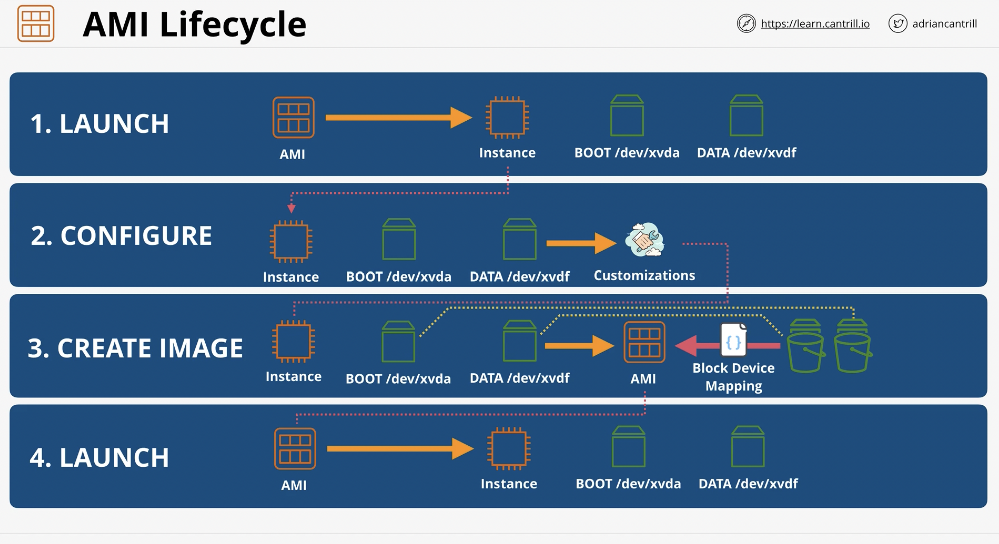

# Amazon Machine Images (AMI's)

- Amazon Machine Images (AMI's) are the images which can create EC2 instances of a certain configuration
- The are regionally unique
- On creation of the AMI, a snapshot is taken of the block device mapping
- An AMI is a logical container that contains a snapshot of the original EBS volumes and device ID's of where it was created
- Snapshots used to create the AMI are housed in S3 (Regionally resilient) so you can use the AMI in new instances within the same region.
- Costs: Only billed for the data used by the snapshots of the EBS volumes used to create the image

---

---

## Exam Powerup

