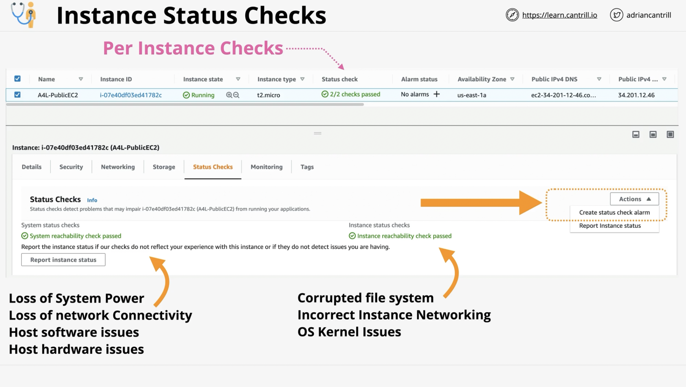
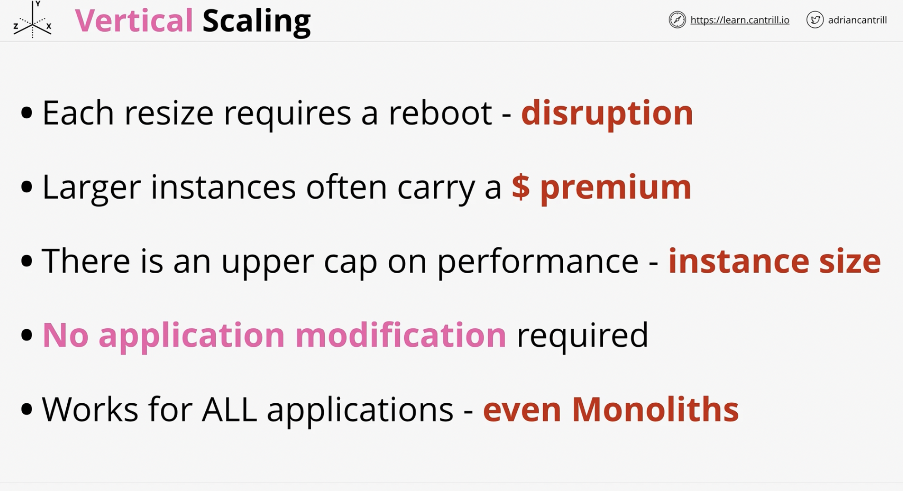
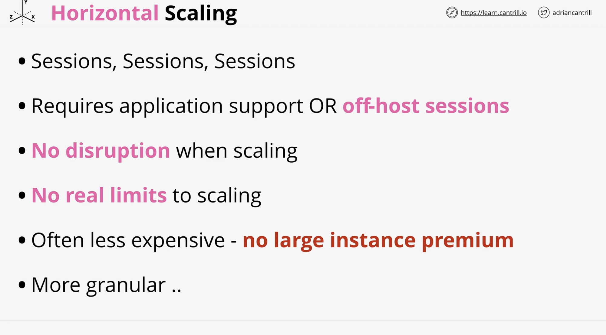
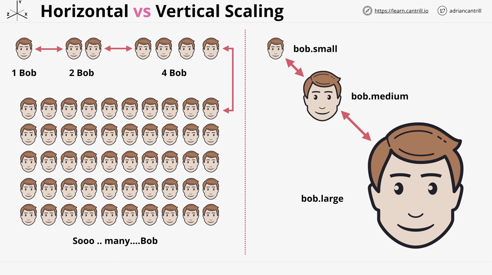
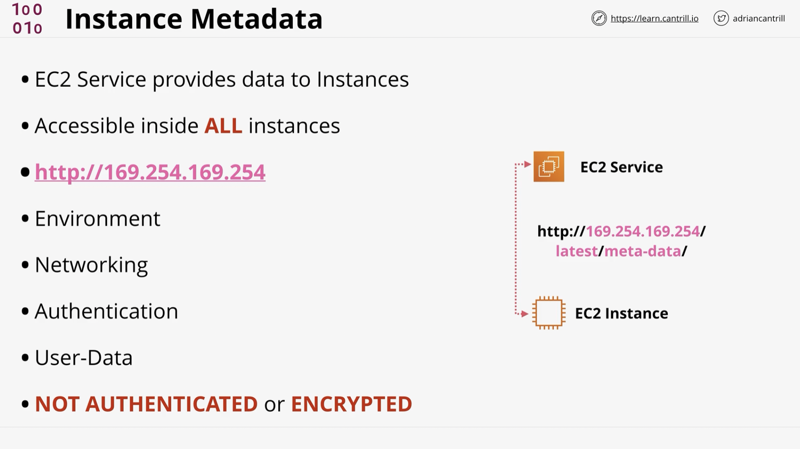

# EC2 Lifecycle and extras

## Instance Status Checks

---

## Horizontal and Vertical Scaling

### Vertial Scaling

- Increase instance size & capacity

---

### Horizontal Scaling

- Increase amount of instances

---

### Scaling comparison

---

## Instance Metadata

Remember:
- `http://169.254.169.254/latest/meta-data`
- No auth and no encryption

