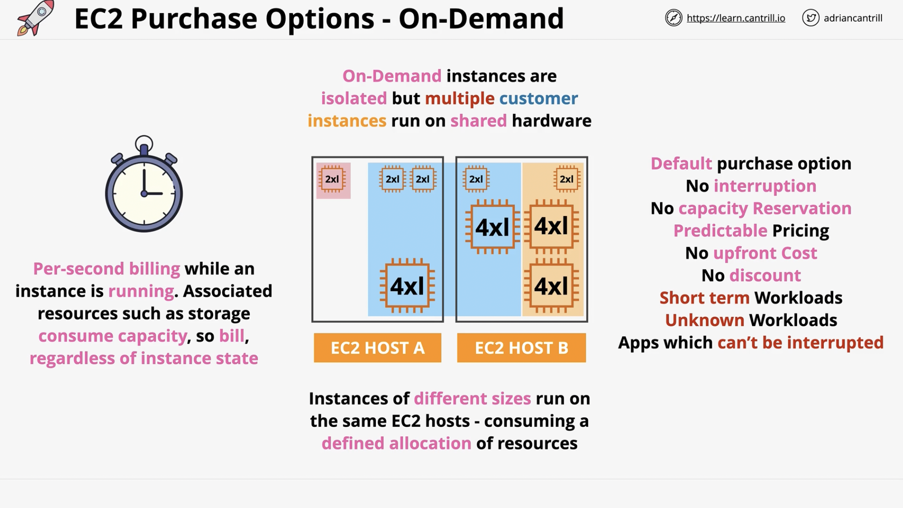
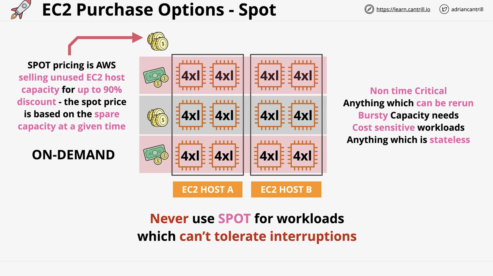
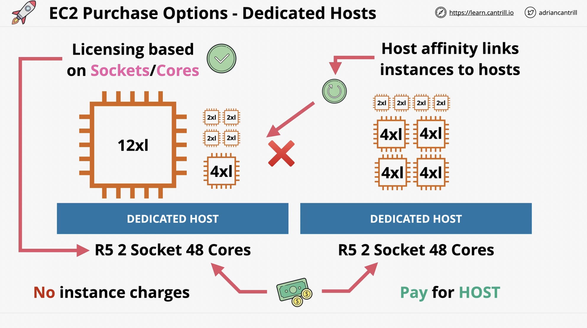
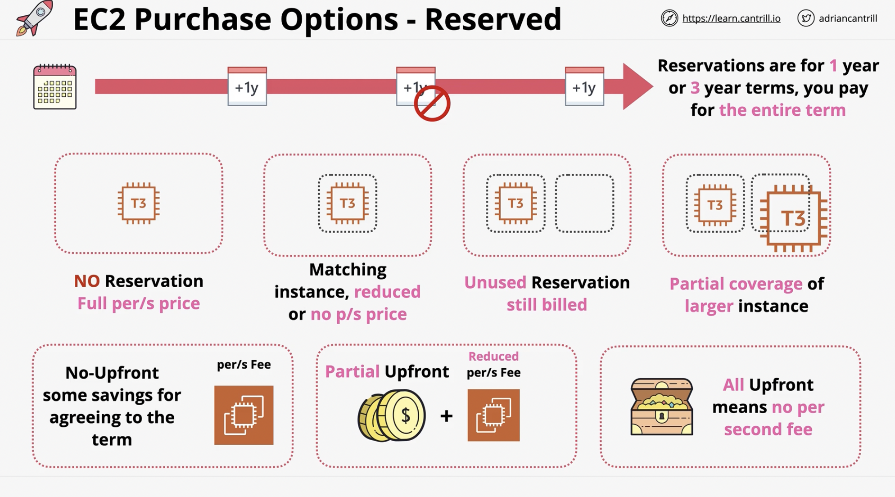
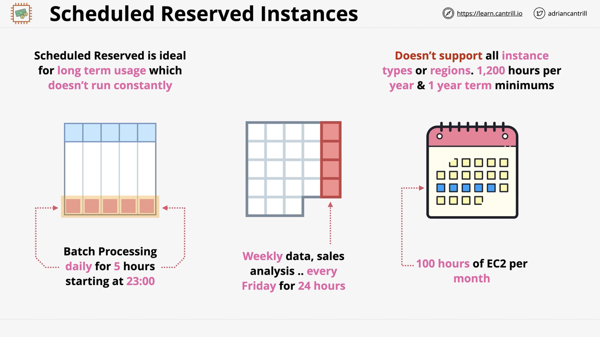
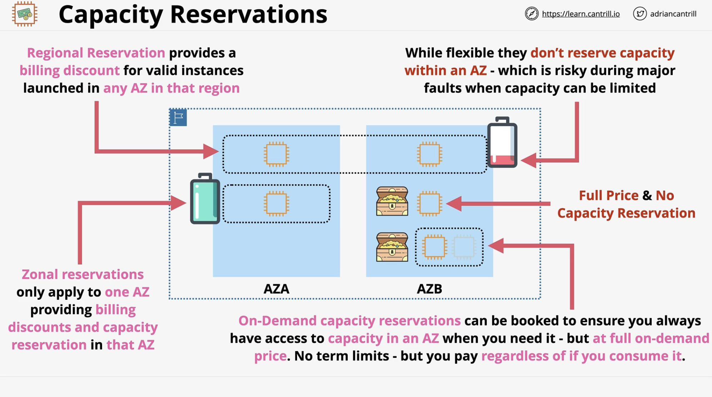
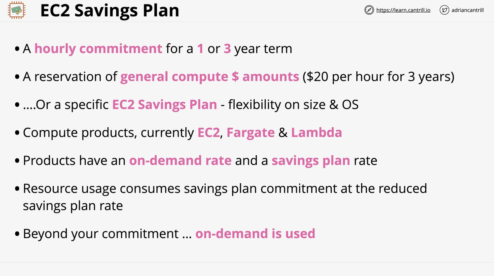

# EC2 Purchase Options

## On-Demand

---

---

## Spot

---

## Dedicated Hosts

- You pay for the host
- No instance charges

---

## Reserved

- Long term consumption of EC2
- Reduce the per second cost
- Unused reservations are still billed

### Scheduled Reserved Instances

---

## Capacity Reservations

---

## EC2 Savings Plan

