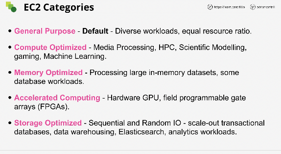
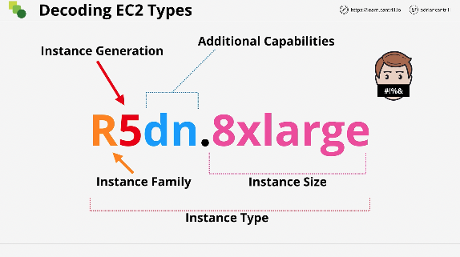
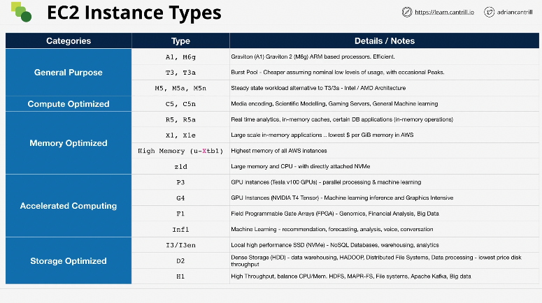

# EC2 Instance Types

- Raw CPU, memory, local storage capacity and type
- Resource ratios
- Storage and Data Network Bandwidth
- System Architecture / Vendor
  - arm or x86
- Additional features and capabilities

## Categories

## Decoding instance types

## Instance types (chart)

---

## Other helpful links

- [EC2 instance info](https://ec2instances.info/)
