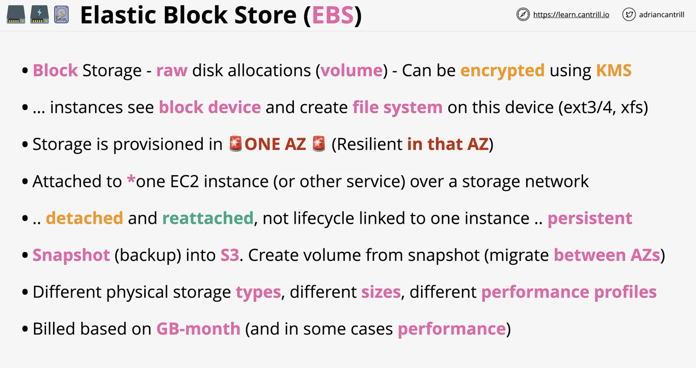
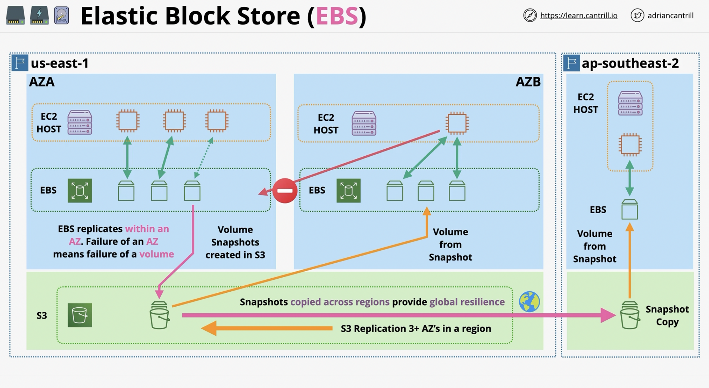
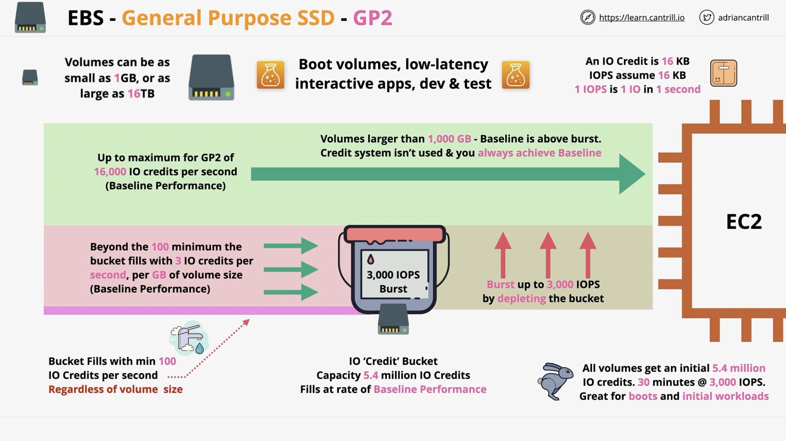
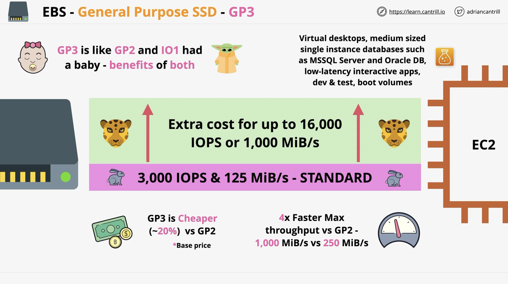
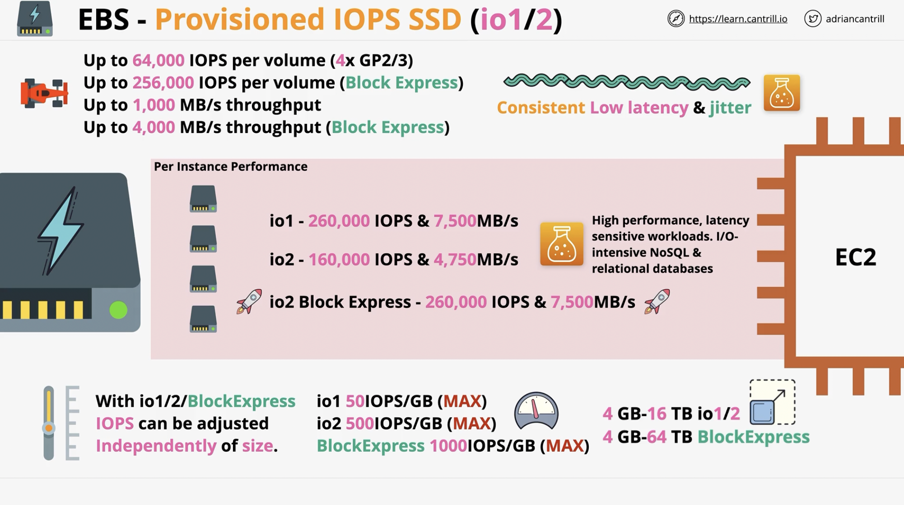
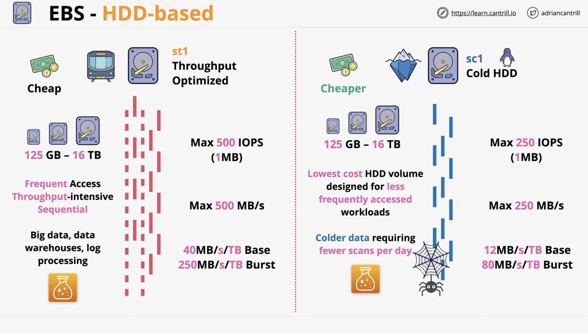
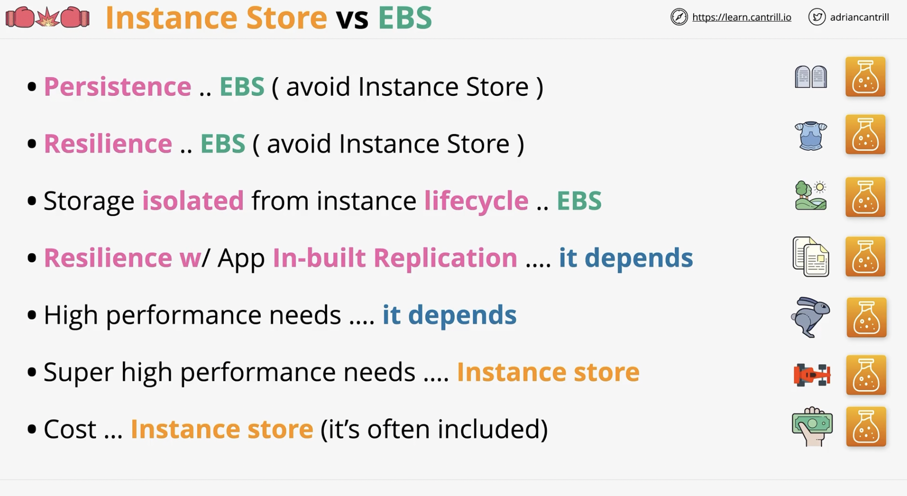
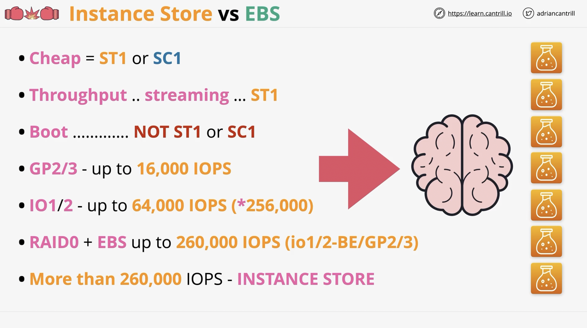

# Storage

## Elastic Block Store (EBS)

- Allocation of raw physical disks
- Are persisted independently from the life of the instance
- Can be detached from an instance and attached to another instance
- Can create a snapshot to S3, which you can then use to migrate data from one AZ to another

## Overview

---

## Architecture

---

## EBS Volume Types

---

### General Purpose SSD - GP2

- Volumes can be as small as 1GB, or as large as 16TB
- Uses an IO credit, an IO credit is 16kb
- 1 IOPS is 1 IO in 1 second
- Great for boot volumes, low-latency, interactive apps, dev & test environments

### General Purpose SSD - GP3

- Comes standard with 3,000 IOPS and 125mb/s throughput
- 20% cheaper vs GP2 in terms of base price
- Use for:
  - Virtual Desktops
  - Low-latency interactive apps
  - Medium sized single instance databases such as:
    - MSSQL
    - Oracle DB
  - Dev/Test Env
  - Boot volumes

### Provisioned IOPS SSD (io1/2)

- Designed for high IOPS and throughput

### HDD Based storage

- ST1 is throughput optimized
  - cheap
  - 125gb-16tb
  - Big data, data warehouses, log processing
- SC1 is cold storage
  - Cheaper than ST1
  - archives
  - designed for less frequently accessed workloads

## Instance Store Volumes

- Block storage devices
- They are local to the EC2 host
- Highest storage performance of all storage classes
- Included in instance price
- Must be attached at launch time
- They are ephemeral - do not store critical data on instance store volumes
- More IOPS and throughput than EBS
- Lost on instance move, resize, or hardware failure
- THEY ARE TEMPORARY

## Instance Store vs EBS

- which to choose?

- performance choices...

