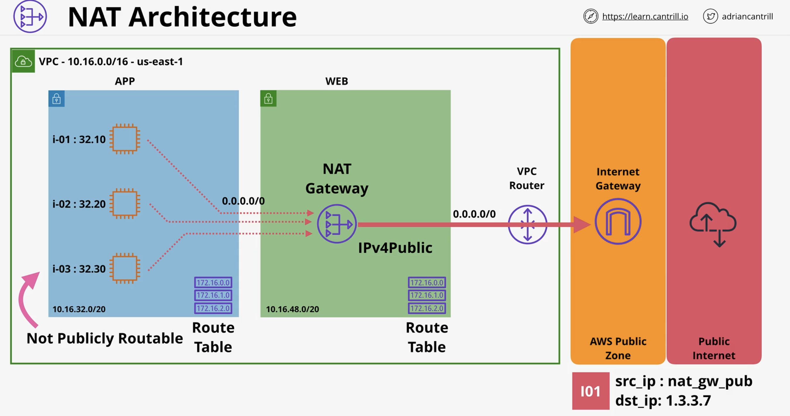
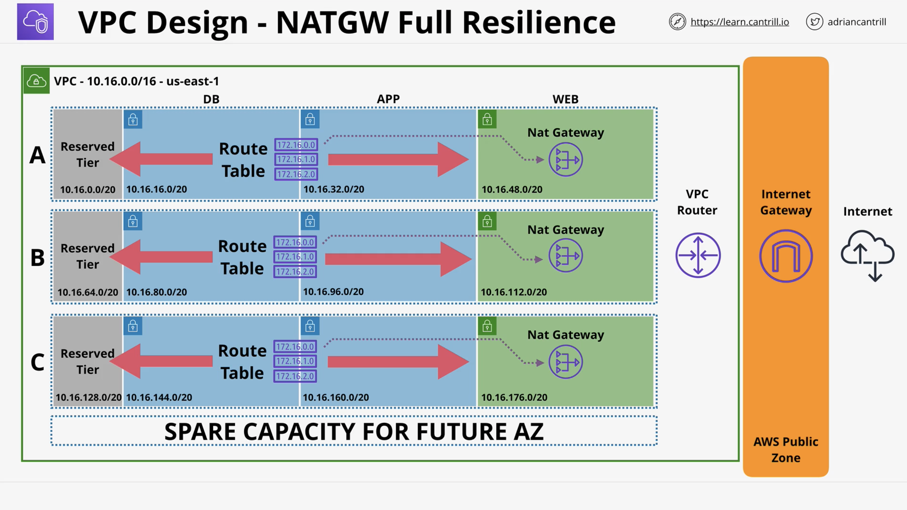
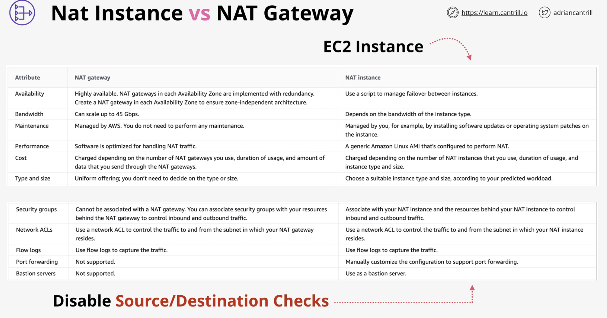

# NAT and NAT Gateways

## Important concepts

* NAT gateways must run from a public subnet so they can direct traffic through the AWS public zone and out to the public internet
* They use Elastic IPs (Static IPv4 Public)
* AZ resilient service (if the AZ goes down, so will the NAT gateway)
* For regional resilience - place a NATGW in each AZ
  * Repeat for each AZ with that NATGW as the target
* Managed service, scales to 45Gbps, $ duration and Data volume (charges are incurred hourly)
* NAT isn't required for IPv6
* All IPv6 addresses in AWS are publically routable
* The IGW works with ALL IPv6 IPs directly
* NAT gateways **don't work with IPv6**
* ::/0 route + IGW for bi-directionaly connectivity
* ::/0 route + Egress-only internet gateway - outbound only

## NAT Gateway architecture

## VPC design using a NAT gateway

## NAT instance vs NAT gateway

