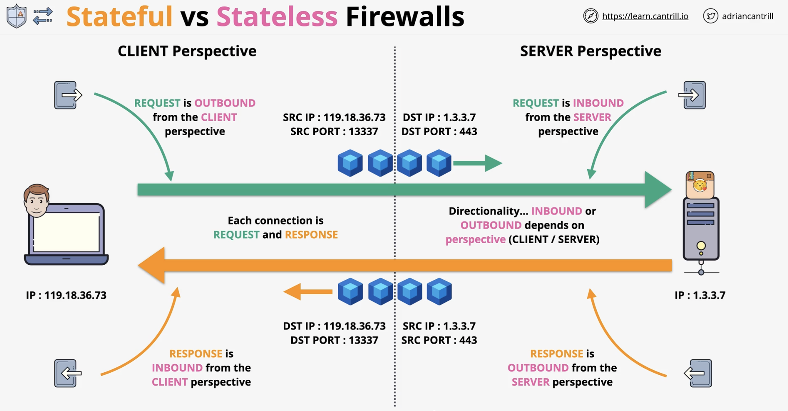
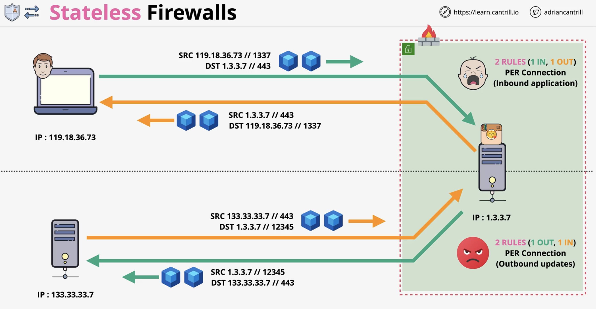
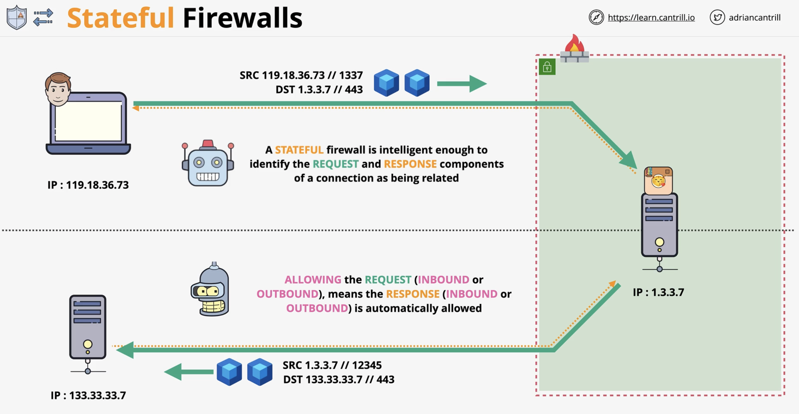

# Stateful & Stateless firewalls

## Concepts to remember

* Each connection from a client to a server has a request and response
* Directionality inbound or outbound depends on the perspective
* A request is outbound from the client perspective, and inbound from the server perspective
* A response is inbound from the client perspective and outbound from the server perspective.

### Client-Server relationship example

* Stateless firewalls do not automatically understand the relationship between inbound and outbound connections from a client to a server
* Stateless firewalls require 2 rules per connection, one for the incoming port, one for the outgoing port.

### Stateless firewall example

* Stateful firewalls are intelligent enough to identify the request and response components of a connection as being related.
* With a stateful firewall, allowing the request (inbound or outbound) means the response (inbound or outbound) is automatically allowed.

### Stateful firewall example

