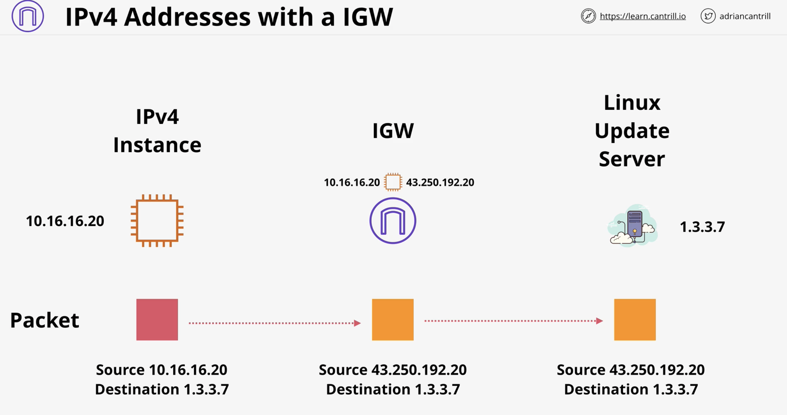
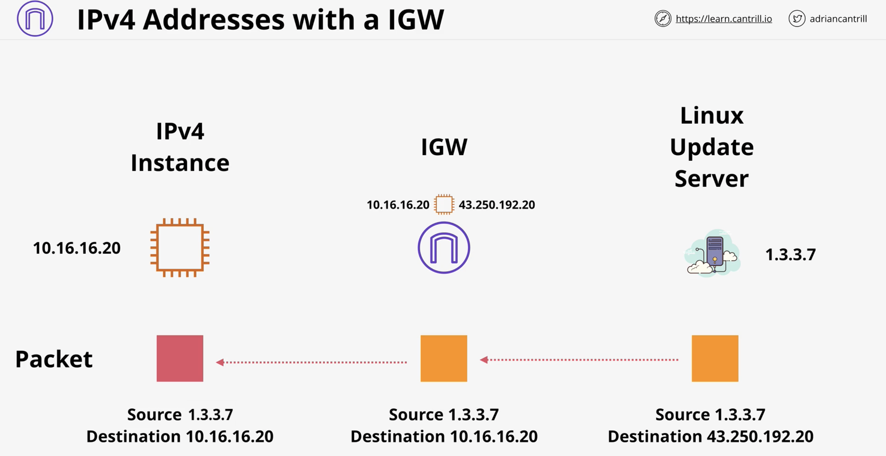

# VPC Routing and Internet Gateway

## Concepts to understand

### VPC Router

* Every VPC has a VPC router - highly available
* In every subnet..."network +1" address
* Routes traffic between subnets
* Controlled by 'route tables' each subnet has one
* A VPC has a main route table - subnet default
* The higher the subnet addres (/{number}), the more specific the IP and is given higher routing priority

### Internet Gateway (IGW)

* Region resilient gateway attached to a VPC
* 1 VPC = 0 or 1 IGW, 1 IGW = 0 or 1 VPC
* Runes from within the AWS Public Zone
* Gateways traffic between the VPC and the Internet or AWS Public Zone (S3, SQS, SNS, etc)

### Bastion host / Jumpbox

* Bastion Host = Jumpbox
* An instance in a public subnet
* Incoming management connections arrive there
* Then access internal VPC resources
* Often the only way in to a VPC

### Visual Aides

---

#### Using an IGW

#### IPv4 address with IGW inbound and outbound

