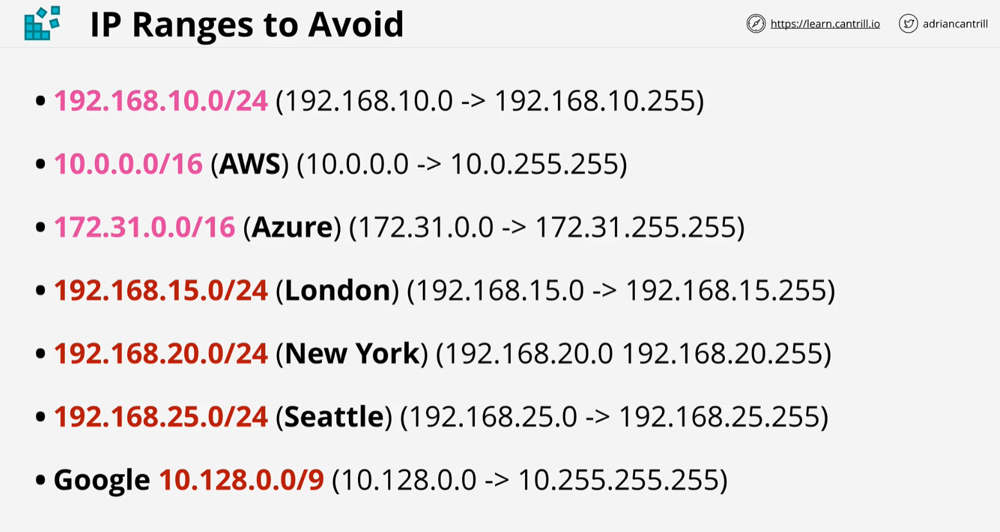

# VPC Sizing & Structure

## Considerations

* What size should be VPC be..
* Are there any networks we can't use...
* VPCs, Cloud, On-prem, partners, vendors
* Try to predict the future...
* VPC structure - tiers & resiliency (availability) zones
* VPC minimum /28 (16 IP), maximum /16 (65456)
* Avoid common ranges (see graphics)
* Reserve 2+ networks per region being used per account

## Helpful links

* [VPC limits](https://docs.aws.amazon.com/vpc/latest/userguide/amazon-vpc-limits.html)
* [AWS VPC Connectivity White Paper](https://d1.awsstatic.com/whitepapers/aws-amazon-vpc-connectivity-options.pdf)
